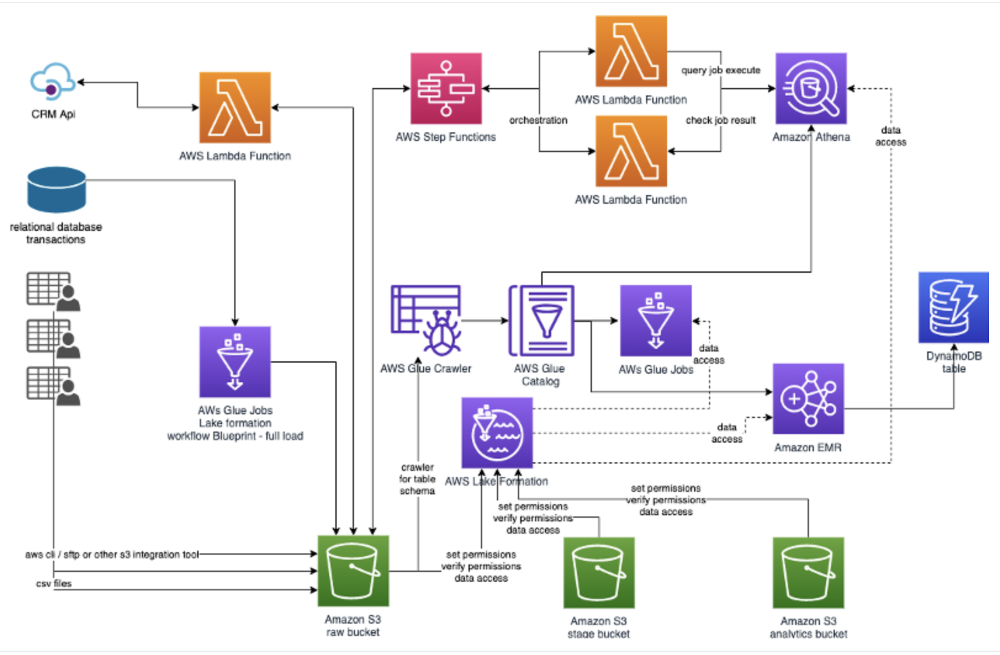

# Welcome to your Customer 360 CDK project

This project will deploy the following architecture components in your account. Please ensure you are using the AWS us-west-2 region as we depend on some region specific resources for this stack to work.



### To get started clone this repo into your local directory

```
git clone git@github.com:sathishc/customer360.git
```

### Configure your aws profile to point to the us-west2 region

This project uses some resources (AMIs) that are only available in us-west-2 hence you need to create this project in that geo

### Install the necessary node modules and bootstrap the CDK

From the project root execute the following commands.

```
npm install
cdk boostrap
```

### Deploy the components

```
cdk deploy
```


### The template creates the following resources to optimize your time. 

1 EC2 Keypair

1 S3 VPC Endpoint and a Secrets Manager Interface endpoint

3 Amazon S3 buckets:

    RawDataS3Bucket
    StageDataS3Bucket
    AnalyticsDataS3Bucket

1 RDS instance with PostgreSQL database to simulate your transaction database.

    RDSSource – sourcemf

6 Lambda functions to generate data for different source.

    c360viewCRMApi
    c360viewGetCRMApi
    c360viewGetGaTables
    c360viewMFgenAccount
    c360viewMFgenCard
    c360viewMFgenGBank

5 CloudWatch events schedules, to trigger the Lambda functions.

2 Security group, firewalls, one for the EC2 instance, other for Replication instances and Lambda functions.

1 Role for the AWS Lambda functions 1 Role for the AWS Glue

1 Amazon EMR cluster

Lakeformation registrations of S3 buckets created. 

Check the status of each resource, and order by resource status.

After you see "CREATE_COMPLETE" for the stack all resources are ready and you can proceed to next step Load Data.
